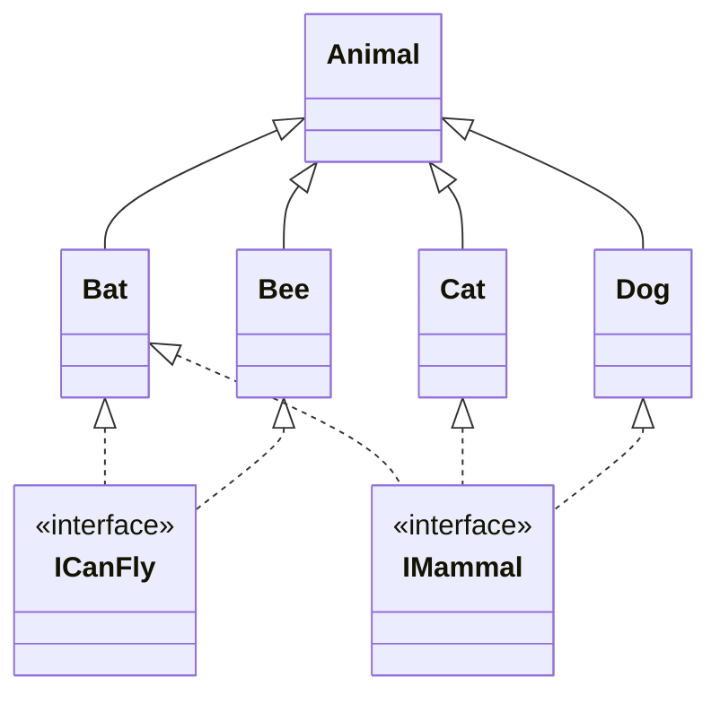

# Simple UML diagram

```mermaid
 classDiagram
    class ICanFly
    <<interface>> ICanFly

    class IMammal
    <<interface>> IMammal

    Animal <|-- Bat
    Animal <|-- Bee
    Animal <|-- Cat
    Animal <|-- Dog

    Bat <|.. ICanFly
    Bat <|.. IMammal
    Bee <|.. ICanFly
    Cat <|.. IMammal
    Dog <|.. IMammal

```
